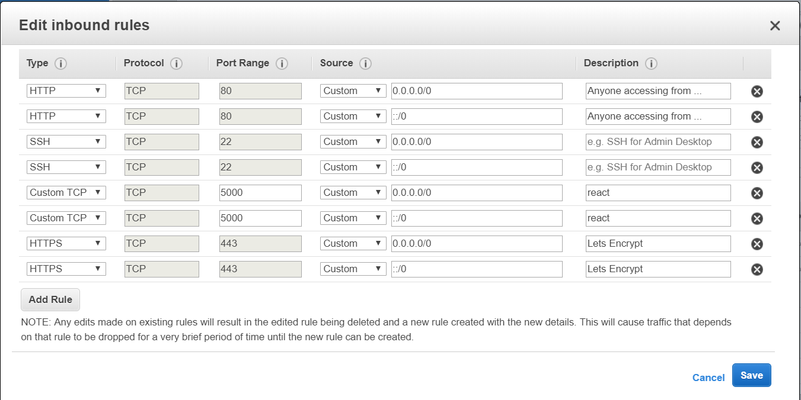

# Splunk Setup

Splunk isn't *that* hard to setup, but there are a couple of small details to keep in mind

##### Links:
- https://www.digitalocean.com/community/tutorials/how-to-install-and-use-docker-on-ubuntu-18-04
- https://docs.splunk.com/Documentation/Splunk/7.3.0/Installation/DeployandrunSplunkEnterpriseinsideDockercontainers
- https://docs.splunk.com/Documentation/Splunk/7.3.1/SearchTutorial/Systemrequirements
- https://docs.splunk.com/Documentation/Splunk/7.3.0/Admin/Installalicense
- https://linoxide.com/linux-how-to/install-splunk-ubuntu/
- https://www.splunk.com/pdfs/technical-briefs/deploying-splunk-enterprise-on-amazon-web-services-technical-brief.pdf
- https://aws-quickstart.s3.amazonaws.com/quickstart-splunk-enterprise/doc/splunk-enterprise-on-the-aws-cloud.pdf
--- 

A list of notes on how to setup Splunk-Docker with a community license

### TLDR Steps
> 0. Request developer license
> 1. Spin up virtual host with right hardware and network requirements
> --> Make sure you apply the networking rules correctly to this, Splunk runs on port 8000, 8089, and 9997
> 2. Install Docker on Ubuntu
> 3. Install Splunk image
--- 

### 0. Request Developer License
Link: https://www.splunk.com/page/sign_up/developer_license?redirecturl=http://dev.splunk.com/page/developer_license_sign_up/
This can take "1-3 business days but I got mine in a week after sending an inquiry to devinfo@splunk.com
" A 10GB for non-customers that goes through an approval process "

--- 


### 1. Spin Up Virtual Host 
For me I used AWS Instance **c5.18xlarge**, 144 GIB memory. AWS has dedicated documentation for Splunk ( https://aws-quickstart.s3.amazonaws.com/quickstart-splunk-enterprise/doc/splunk-enterprise-on-the-aws-cloud.pdf )

| Instance Type       | Daily Indexing Volume       | Users  |
| ------------- |:-------------:| -----:|
| c4.2xlarge   | <100 | <8? |
| c4.4xlarge    | 100-200    |   8? |
| c4.8xlarge | 200-300+     |    16? |

This was the table for **indexers**, but you can use them as a guidelines for ideas on what hardware requirements
###### Networking Rules


I used Ubuntu for this but any Docker/Splunk supported system will work

--- 

### 2. Install Docker 
Docker had some pretty specific instructions for Ubuntu. Digital Ocean's walkthrough was the easiest to follow
Docker's documentation: 
Digital Ocean: https://www.digitalocean.com/community/tutorials/how-to-install-and-use-docker-on-ubuntu-18-04

> sudo apt-get remove docker docker-engine docker.io containerd runc
> sudo apt install apt-transport-https ca-certificates curl software-properties-common
> curl -fsSL https://download.docker.com/linux/ubuntu/gpg | sudo apt-key add -
> sudo add-apt-repository "deb [arch=amd64] https://download.docker.com/linux/ubuntu bionic stable"
```
Hit:1 http://us-west-2.ec2.archive.ubuntu.com/ubuntu bionic InRelease
Hit:2 http://us-west-2.ec2.archive.ubuntu.com/ubuntu bionic-updates InRelease
Hit:3 http://us-west-2.ec2.archive.ubuntu.com/ubuntu bionic-backports InRelease
0% [1 InRelease gpgv 242 kB] [Connecting to security.ubuntu.com (91.189.88.149)]
Get:4 https://download.docker.com/linux/ubuntu bionic InRelease [64.4 kB]
Hit:5 http://security.ubuntu.com/ubuntu bionic-security InRelease
```
> sudo apt-get update
```
Hit:1 http://us-west-2.ec2.archive.ubuntu.com/ubuntu bionic InRelease
Hit:2 http://us-west-2.ec2.archive.ubuntu.com/ubuntu bionic-updates InRelease
Hit:3 http://us-west-2.ec2.archive.ubuntu.com/ubuntu bionic-backports InRelease
Hit:4 https://download.docker.com/linux/ubuntu bionic InRelease
Hit:5 http://security.ubuntu.com/ubuntu bionic-security InRelease
```
> apt-cache policy docker-ce
```docker-ce:
  Installed: (none)
  Candidate: 5:19.03.1~3-0~ubuntu-bionic
  Version table:
     5:19.03.1~3-0~ubuntu-bionic 500
        500 https://download.docker.com/linux/ubuntu bionic/stable amd64 Packages
     5:19.03.0~3-0~ubuntu-bionic 500
        500 https://download.docker.com/linux/ubuntu bionic/stable amd64 Packages
```
> sudo apt install docker-ce       
```
Reading state information... Done
The following additional packages will be installed:
  aufs-tools cgroupfs-mount containerd.io docker-ce-cli libltdl7 pigz
The following NEW packages will be installed:
  aufs-tools cgroupfs-mount containerd.io docker-ce docker-ce-cli libltdl7 pigz
0 upgraded, 7 newly installed, 0 to remove and 0 not upgraded.
Need to get 88.0 MB of archives.
After this operation, 390 MB of additional disk space will be used.
Do you want to continue? [Y/n] y
Get:1 http://us-west-2.ec2.archive.ubuntu.com/ubuntu bionic/universe amd64 pigz amd64 2.4-1 [57.4 kB]
Get:2 http://us-west-2.ec2.archive.ubuntu.com/ubuntu bionic/universe amd64 aufs-tools amd64 1:4.9+20170918-1ubuntu1 [104 kB]
Get:3 http://us-west-2.ec2.archive.ubuntu.com/ubuntu bionic/universe amd64 cgroupfs-mount all 1.4 [6320 B]
Get:4 http://us-west-2.ec2.archive.ubuntu.com/ubuntu bionic/main amd64 libltdl7 amd64 2.4.6-2 [38.8 kB]
Get:5 https://download.docker.com/linux/ubuntu bionic/stable amd64 containerd.io amd64 1.2.6-3 [22.6 MB]
Get:6 https://download.docker.com/linux/ubuntu bionic/stable amd64 docker-ce-cli amd64 5:19.03.1~3-0~ubuntu-bionic [42.5 MB]
Get:7 https://download.docker.com/linux/ubuntu bionic/stable amd64 docker-ce amd64 5:19.03.1~3-0~ubuntu-bionic [22.7 MB]
```
> root@ip-172-31-31-207:/etc/apt# sudo systemctl status docker
```docker.service - Docker Application Container Engine
   Loaded: loaded (/lib/systemd/system/docker.service; enabled; vendor preset: e
   Active: active (running) since Sun 2019-08-04 05:39:12 UTC; 4min 28s ago
     Docs: https://docs.docker.com
 Main PID: 8533 (dockerd)
    Tasks: 24
   CGroup: /system.slice/docker.service
           └─8533 /usr/bin/dockerd -H fd:// --containerd=/run/containerd/contain
 ```
         
 ### 3. Pull Splunk Image
 https://docs.splunk.com/Documentation/Splunk/7.3.0/Installation/DeployandrunSplunkEnterpriseinsideDockercontainers
> docker pull splunk/splunk:latest
```latest: Pulling from splunk/splunk
f5d23c7fed46: Pull complete
3ad86e920aec: Pull complete
... 
Digest: sha256:ffab00f77a8f866975d8f926ebd6f63a58b52744
Status: Downloaded newer image for splunk/splunk:latest
docker.io/splunk/splunk:latest
```
> docker run -d -p 8000:8000 -e 'SPLUNK_START_ARGS=--accept-license' -e 'SPLUNK_PASSWORD=<password>' splunk/splunk:latest
``` Container ID: 
  b062256f0976a507c93898f4e36210479149fb688bfb83ad2ccef8fc 
```
  The default account for Splunk is ```python admin ```, and in here you specify the password with docker run 
 
> docker ps -a -f <Container ID>
```
CONTAINER ID        IMAGE                  COMMAND                  CREATED             STATUS                             PORTS                                                                           NAMES
b062256f0976        splunk/splunk:latest   "/sbin/entrypoint.sh…"   18 seconds ago      Up 17 seconds (health: starting)   8065/tcp, 8088-8089/tcp, 8191/tcp, 9887/tcp, 0.0.0.0:8000->8000/tcp, 9997/tcp   brave_keller
root@ip-172-31-8-185:/home/ubuntu#
  ```

 


